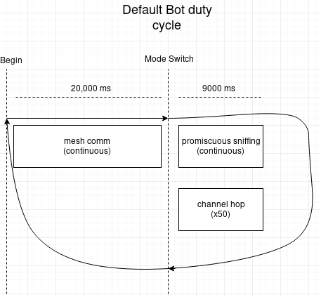
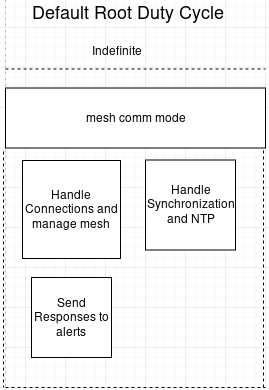
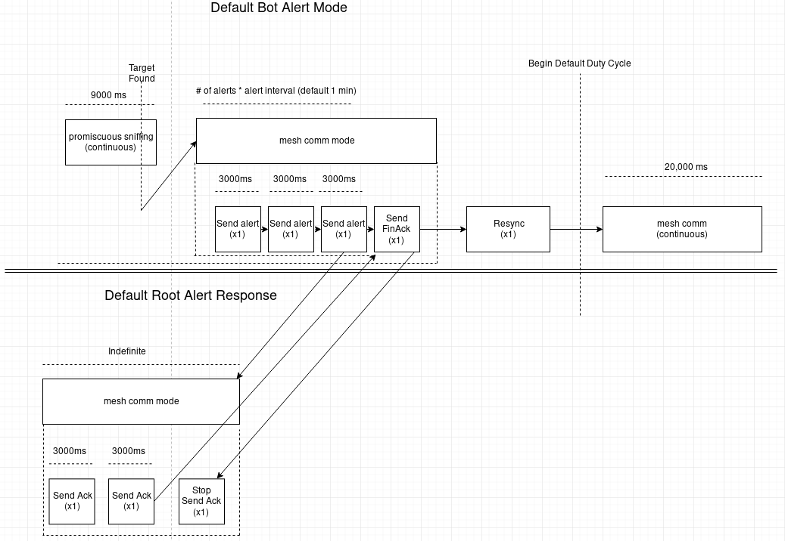
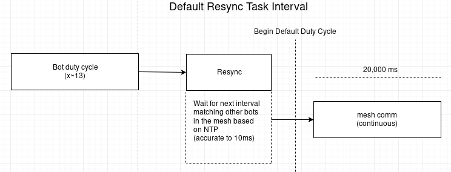
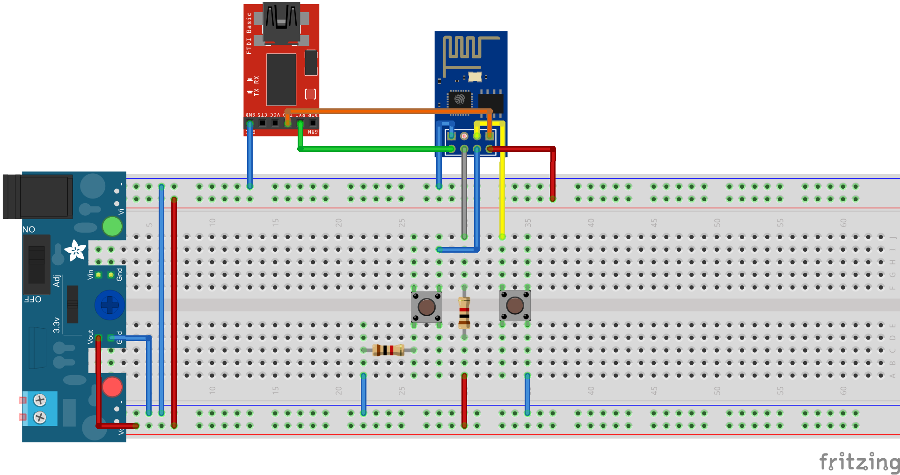

# Fox Trap

Accompanying blog post is [located here.](https://blog.joeminicucci.com/2019/wireless-implant-c2-security-ops)
Fox Trap is a wireless mesh based Command and Control infrastructure for locating mobile rogue access points. The original idea was to plant cheap wireless SOCs in a wireless theater which could detect multiple rogue aps as well as receive commands. Each **[Bot Node](https://github.com/joeminicucci/fox_trap/blob/master/fox_bot)** works by having tasks run synchronously, such as wireless packet sniffing, and then dropping into a communication mode where the mesh network exchanges information and passes it back to a **[Root Node](https://github.com/joeminicucci/fox_trap/tree/master/fox_track)**. The framework was written for the [ESP8266](https://www.espressif.com/en/products/hardware/esp8266ex/overview) and leverages the [EspressIf ESP-SDK](hhttps://www.espressif.com/en/products/software/esp-sdk/overview). Other chips utilizing the ESP-SDK should also be compatible. The current implementation scans for probes or beacons which originate from any of the target BSSIDs defined.

## Installation

We recommend using Atom IDE and PlatfomIO as a development environment. Assuming you have those installed, simply clone the project and open it with PlatformIO. If you want to create the project from scratch, be sure to set NodeMCU as the chipset firmware. Optionally, you can use the Signal CLI to report target sightings via a Signal group.
* [PlatformIO](https://github.com/esp8266/arduino#using-platformio)
* **OPTIONAL** [Signal-CLI](https://github.com/AsamK/signal-cli)

### Versioning
The last known good upstream versions of Fox Trap's dependencies are the following:
* ArduinoJson@6.11.0
* painlessMesh@1.4.0

Around July 2019, one of the upstream dependencies completely broke the Task Scheduling functionality of the project, therefore it is recommended to run using the above listed dependency versions.

## Configuration
The design philosophy of the framework is to base all decisions off of the interval lengths of each task. To understand the tasks, please see the Software Implementation Section below. Otherwise you may run it with the default values and skip to the Usage section.

### Bot Config
Tailor the following variables (directly below the #include directives) to your wireless environment:
 * uint16_t channel : Wireless Channel
 * uint32_t meshCommInterval : The amount of time for mesh communication (Default 20000 ms)
 * uint32_t sniffInterval : The amount of time to sniff for targets (Default 9000 ms)
 * uint32_t resyncInterval : How often to resyncronize communication to the (Default 900000)
 * uint8_t channelHopInterval : How often to change channels while in sniff mode (Default 400 ms)
 * unsigned long alertSeconds : How often to send a sighting alert across the mesh (Default 3 seconds)
 * uint32_t alertTimes : How many times to attempt to send a sighting alert (Default 20 times)

#### Wifi Configuration
Define the Wifi config the same in both root and bots
```
#define   MESH_PREFIX     "Your_Mesh_SSID"
#define   MESH_PASSWORD   "Your_Mesh_Password"
#define   MESH_PORT       5566
```
##### Setting the target(s)
###### Method 1) Hard code targets
Change _targets vector. For example if you were looking for ```00:20:91:1A:22:33``` and ```00:20:91:1A:22:44``` your vector would look like
```
std::vector<std::array<uint8_t, 6> > _targets =
        {
          { 0x00, 0x20, 0x91, 0x1A, 0x22, 0x33 },
          { 0x00, 0x20, 0x91, 0x1A, 0x22, 0x44 }
};
```
###### Method 2) Update over the air (serial is connected root node)
Interactive Mode
```
c2Update.py -s /dev/ttyUSB1 -i
tar 0020911A2233
```
Single Command
```
c2Update.py -s /dev/ttyUSB1 -c tar 0020911A2233
```
##### Removing the target(s)

Update over the air (serial is connected root node)

###### Method 1) Interactive Mode
```
c2Update.py -s /dev/ttyUSB1 -i
rem 0020911A2233
```
###### Method 2) Single Command
```
c2Update.py -s /dev/ttyUSB1 -c rem 0020911A2233
```

#### Root Config

Wifi Configuration : Define the Wifi config the same in both root and bots
```
#define   MESH_PREFIX     "Your_Mesh_SSID"
#define   MESH_PASSWORD   "Your_Mesh_Password"
#define   MESH_PORT       5566
```
Tailor the following variables (directly below the #include directives) to your wireless environment:
 * unsigned long ackSeconds : How often you want the root to send acknowledgement signals back to bots with sightings (Default 3 seconds)
 * uint32_t ackTimes : How long you want the root to send acknowledgement signals back to bots (default 20 times)

## Usage
The root operates over a serial port.
There are two serial monitoring modes invoked with the [Python 2 c2 script](fox_track/src/c2.py):
 * Mode 1 uses pyserial and may require adjustment to the timeout parameter, however provides more granular monitoring.
 * Mode 2 uses the PlatformIO serial monitoring tool

### Generic usage:

```
usage: c2.py [-h] -s SERIALPORT [-u SIGNALUSERID] [-g SIGNALGROUPID] -m MODE
```

### Typical Scenario
Monitor in Mode 1, exit when target found

```
python2 c2.py -s /dev/ttyUSB1 -m 1
```
### Signal Notification Scenario:
Monitor and send signal notifications (from user 123) to a group (345) when a target is found, then exit

```
python2 c2.py -s /dev/ttyUSB1 -u 123 -g 345 -m 2
```

### airodump-ng Auto-Hunt Scenario
Run the Signal Notification Scenario, exit when target found and immeadeatly drop into airodump-ng scan mode with the target MAC and channel selected
```
python2 c2.py -s /dev/ttyUSB1 -u 123 -g 345 -m 2 && launchAiro.sh
```
## Software Implementation

### Bot Tasking
Bots are either in communication mode or sniffing the air for target BSSIDs. Each bot reports back to the root node as soon as it detects a target. The following tasks are used to accomplish this:

   * botInitialization : Places the bot into mesh communication mode to talk to the network. All bots must be in communication at the same time.
   * channelHop : Changes the wireless channels at specified time intervals while sniffing.
   * resync : Sets flag to resynchronize node to the mesh at a guaranteed period.
   * snifferInitialization : Places the node into 'sniffing' promiscuous mode and scans the air for a BSSID (MAC) contained in the targets list which is either probing or beaconing.
   * sendAlert : Drops out of sniffing mode when a target is found and continuously reports to the mesh for specified periods.

   

### Root Tasking
The root node simply opens the mesh and handles communications across the mesh network with the following tasks:
   * rootInitializationTask : a one time mesh initialization which opens the network
   * acknowledgementTask : these tasks are only used after receiving a target sighting from a bot. It will attempt for a given amount of times / per interval to acknowledge to the bot it has received the sighting so that the bot can go back to doing its jobs (See alert mode diagram). The bot will subsequently send a finAck to get the server to stop this task.

   

### Alert Mode
Alert mode occcurs when a bot finds a target BSSID in promiscuous 'sniffer' mode. It immeadeatly drops out of sniffer mode and sends a pre-defined amount of alerts (default ``uint32_t alertTimes = 20;``) at a pre-defined interval (default ``uint32_t alertTimes = 3;``). As soon as the root discovers one of these alerts, it too fires of a pre-defined amount of acknowledgements (default ``unsigned long uint32_t ackTimes = 20;``)  at a pre-defined interval (default ``unsigned long ackSeconds = 3;``). Finally, if the bot receives the acknowledgement, it will fire one finish acknowledgement message back to the root in an attempt to quiet the root down. It then resynchronizes itself, and returns to the normal duty cycle.



### Resynchronization
Fundamentally, bots should all be in communication at the same time so that nodes which are far away can reach the root. This guarantees nodes in the network won't be sinkholed. Over extended periods of time, the nodes will fall out of sync with one another, i.e. one will scan while another is communicating. Since the painlessMesh library includes built in NTP time with a precision of 10ms, it is guaranteed that nodes have a common concept of the network. This is used by Fox Track to find the next duty cycle time of all bots in the network, and waits to start its duty cycle accordingly followed by negation of the resync flag. This waiting occurs when the resync flag is set to true, and after negation it is reset every ``uint32_t resyncInterval`` ms (default 900000 ms).



## Hardware Implementation


* [ESP8266](https://www.amazon.com/gp/product/B071HCX3X7/ref=oh_aui_search_detailpage?ie=UTF8&psc=1)
* [FTDI 3.3v USB-Serial](https://www.amazon.com/SparkFun-FTDI-Basic-Breakout-3-3V/dp/B004G52QR0)
* [Breadboard, jumpers, resistors (10k), switches](https://www.amazon.com/SunFounder-Sidekick-Breadboard-Resistors-Mega2560/dp/B00DGNZ9G8)

## Software used

* [PlatformIO](https://github.com/esp8266/arduino#using-platformio)
* [Painless Mesh](https://gitlab.com/painlessMesh/painlessMesh)
* [Arduino Task Scheduler](https://github.com/arkhipenko/TaskScheduler)
* [Ray Burnette's Wifi Sniffer](https://www.hackster.io/rayburne/esp8266-mini-sniff-f6b93a)
* [rw950431's Probe collection logic](https://github.com/rw950431/ESP8266mini-sniff)
* [ArduinoJson](https://github.com/bblanchon/ArduinoJson)
* [Signal-CLI](https://github.com/AsamK/signal-cli)

## Authors

* **[Joe Minicucci](https://github.com/joeminiccci)** - *Software implementation and architecture*
* **[Todd Cronin](https://github.com/t0ddpar0dy)** - *Hardware and conceptual design*

## License

This project is licensed under The MIT License - see the [LICENSE.mit](LICENSE.mit) file for details

## Acknowledgments

* Defcon Wireless Village - Thanks for holding the Defcon wireless WTF and for the inspiration to create Fox Trap
* Lars Juhl Jensen - Thanks for the [idea](https://github.com/larsjuhljensen/phatsniffer) of sending commands over serial. A future implementation could use the same logic to create a more robust command infrastructure.

## TODO
 * Ideas for future c2 updates (sorted least-most effort)
   * Remove all bssids command
   * Sync the NTP interval with the python updater so the command propagation does not need to be timed by operator
   * Change MAC addresses, SSID, and WIFI password to subvert adversarial traffic / attack (over the air)
   * Weaponization (most likely better suited to other projects)
     * Beacon / Probe spamming to disinform
     * Distributed Deauthentication
